# Real Estate ERP & CRM System 

A specialized Full-Stack ERP (Enterprise Resource Planning) solution designed to digitize real estate operations. This project was inspired by real-world manual workflow challenges to automate project management, client negotiations, and financial installment tracking.
##  Why This Project? (The Problem)
In many real estate agencies, operations like unit bookings and installment tracking are still handled manually on paper. This leads to data inconsistency and slow approval cycles. I developed this system to provide a **Digital Transformation** solution that centralizes data and automates the financial lifecycle of property sales.

##  Core Features

### 1. Role-Based Access Control (RBAC) 
The system implements a secure multi-user environment where each role (Admin vs. Employee) has a tailored interface and specific permissions.

<table style="width: 100%; border-collapse: collapse; border: none; table-layout: fixed;">
  <tr>
    <td style="width: 20%; padding: 5px; text-align: center; border: none; vertical-align: top;">
      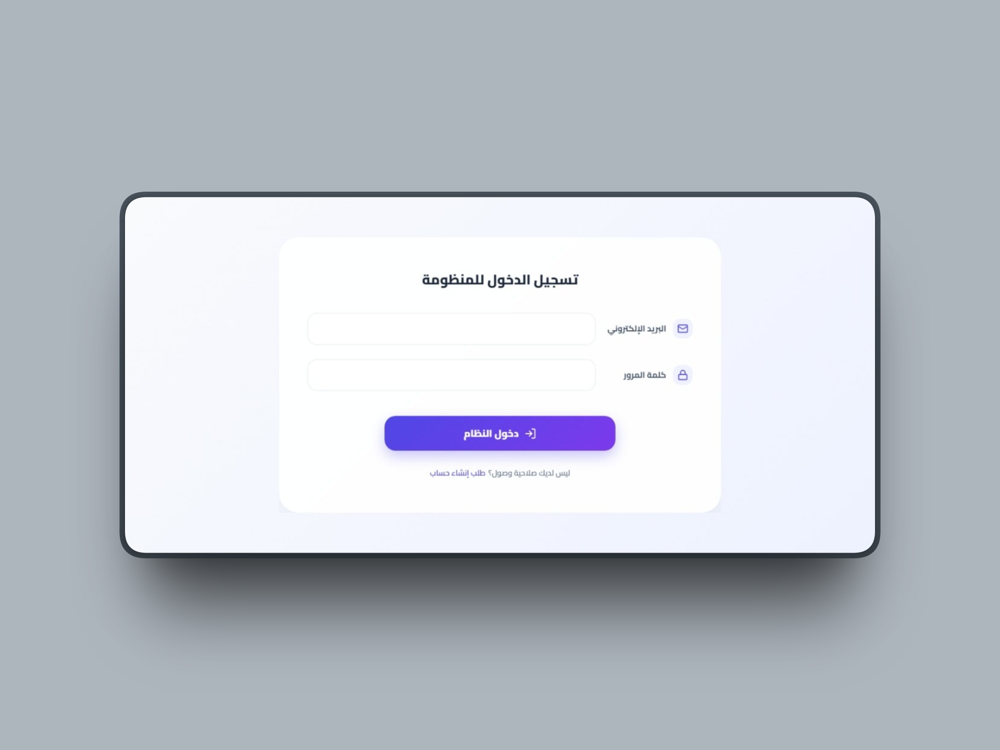
      
<em>1. <b>Login:</b> Secure staff access.</em>

    </td>
    <td style="width: 20%; padding: 5px; text-align: center; border: none; vertical-align: top;">
      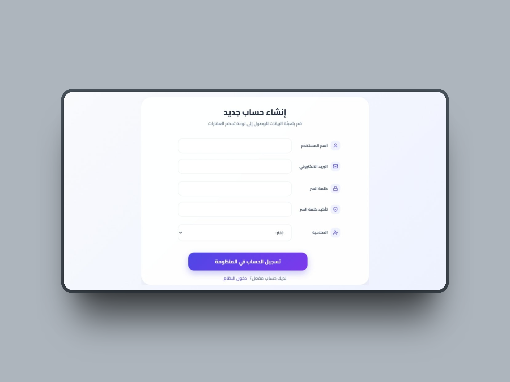
      
<em>2. <b>Registration:</b> Staff onboarding.</em>

    </td>
    <td style="width: 20%; padding: 5px; text-align: center; border: none; vertical-align: top;">
      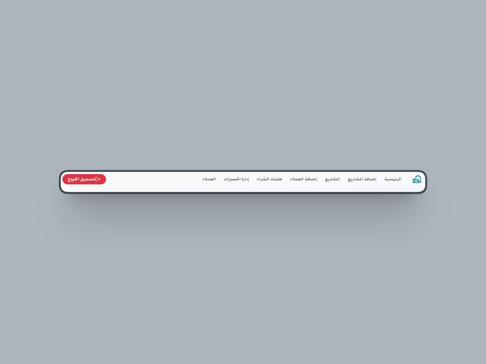
      
<em>3. <b>Admin View:</b> Full system access.</em>

    </td>
    <td style="width: 20%; padding: 5px; text-align: center; border: none; vertical-align: top;">
      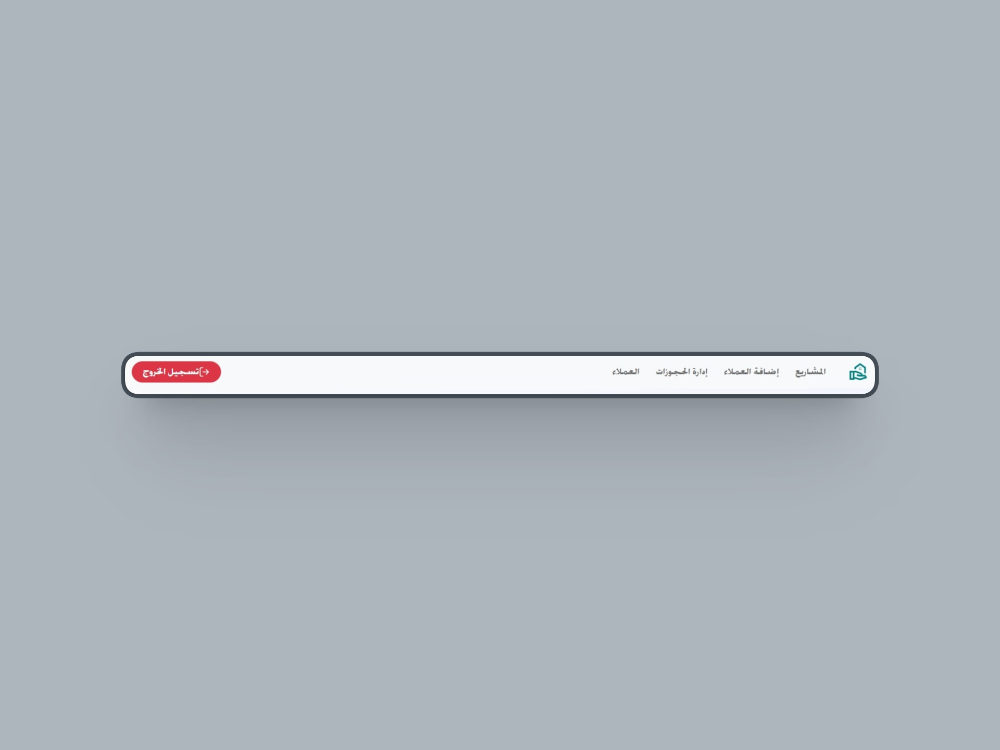
      
<em>4. <b>Staff View:</b> Sales-focused portal.</em>

    </td>
    <td style="width: 20%; padding: 5px; text-align: center; border: none; vertical-align: top;">
      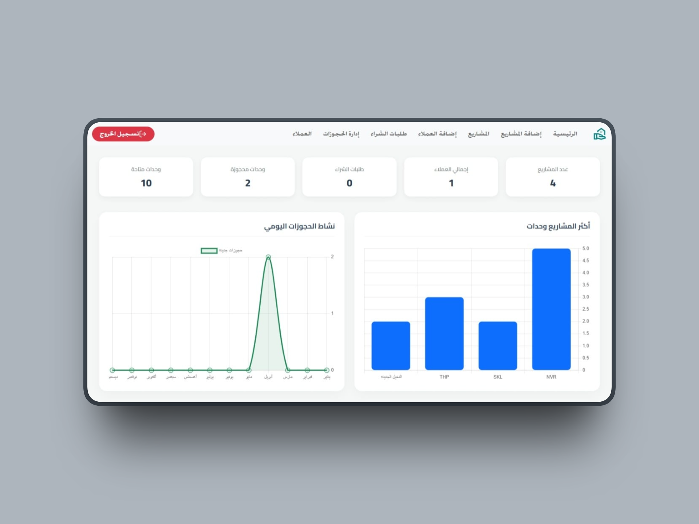
      
<em>5. <b>Analytics:</b> Live data visualization.</em>

    </td>
  </tr>
</table>

* **Security & Auth:** Robust protection using **JWT** and **BCrypt** hashing.
* **Role-Specific Portals:** Tailored Dashboards for Admins (Analytics via **Chart.js**) and Employees (Sales & Client Management).
  
### 2. Project & Unit Inventory (Master-Detail) 
* **Master-Detail Architecture:** Administrators can create projects and dynamically add associated units with detailed specifications (Area, Floor, Price, Images, and Status).
* **Live Inventory:** A real-time display of available vs. reserved units for sales teams.
  
<table style="width: 100%; border-collapse: collapse; border: none; table-layout: fixed;">
  <tr>
    <td style="width: 25%; padding: 5px; text-align: center; border: none; vertical-align: top;">
      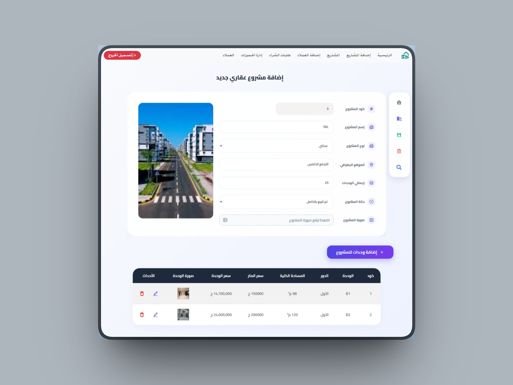
      
<em>1. <b>Creation:</b> Defining project scope.</em>

    </td>
    <td style="width: 25%; padding: 5px; text-align: center; border: none; vertical-align: top;">
      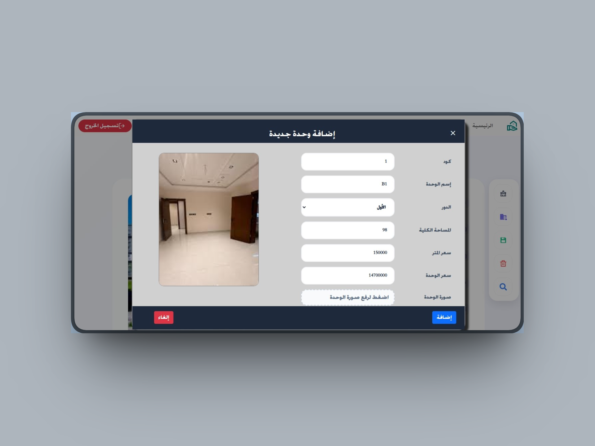
      
<em>2. <b>Unit Data:</b> Dynamic specifications.</em>

    </td>
    <td style="width: 25%; padding: 5px; text-align: center; border: none; vertical-align: top;">
      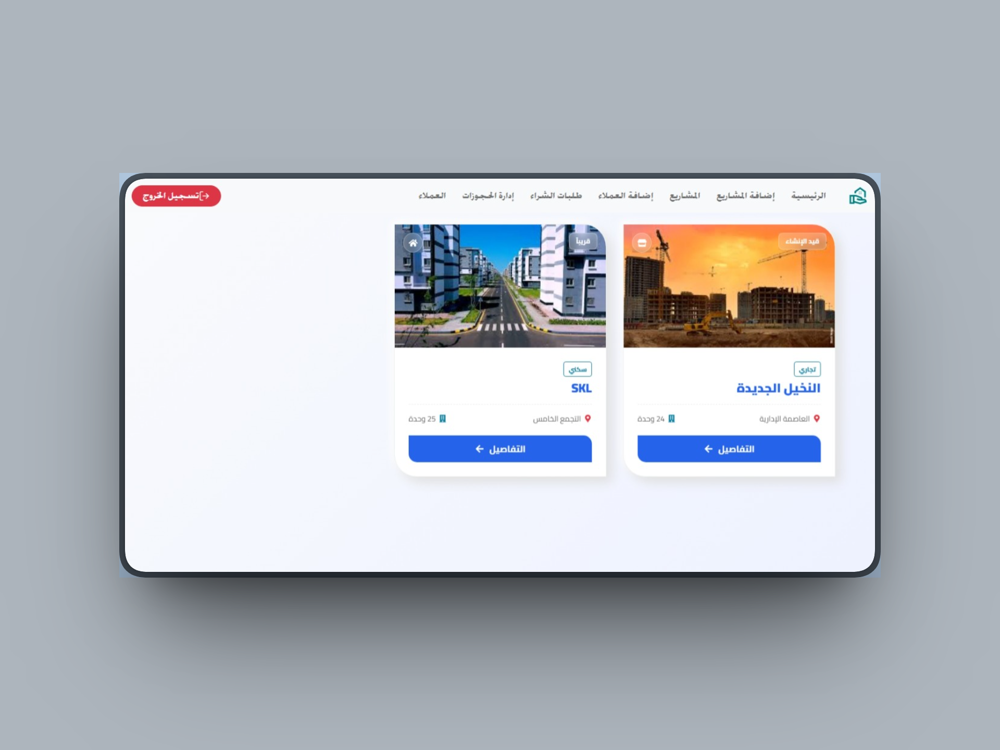
      
<em>3. <b>Showcase:</b> Visual project gallery.</em>

    </td>
    <td style="width: 25%; padding: 5px; text-align: center; border: none; vertical-align: top;">
      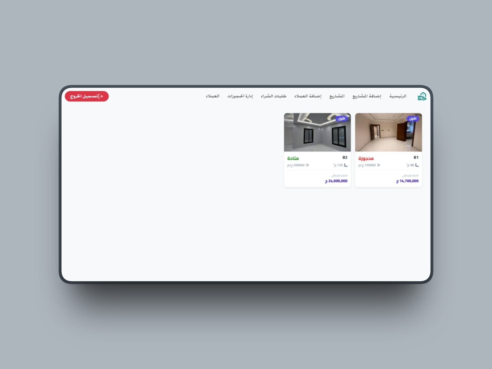
      
<em>4. <b>Inventory:</b> Real-time status update.</em>

    </td>
  </tr>
</table>

### 3. Advanced Negotiation & Approval Workflow 
* **Request Initiation:** Sales employees can submit "Negotiation Requests" if a client proposes a different price.
  
| **Step 1: Initiation** | **Step 2: Negotiation Modal** | **Step 3: Result in Table** |
| :---: | :---: | :---: |
| 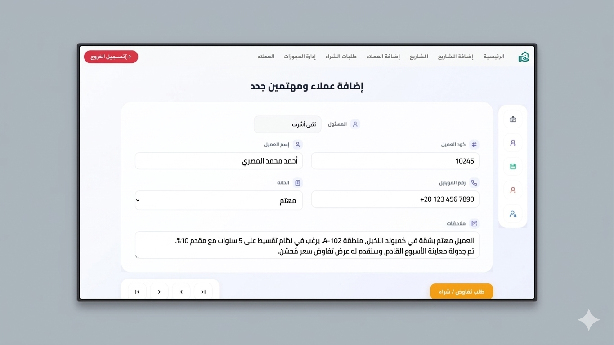 | 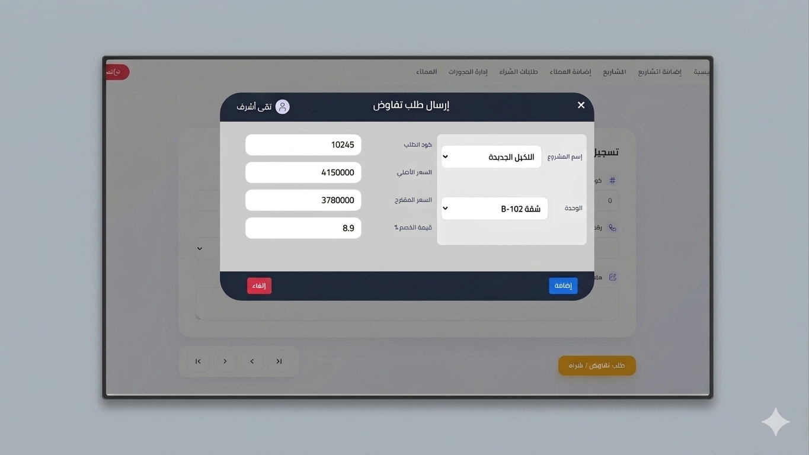 | 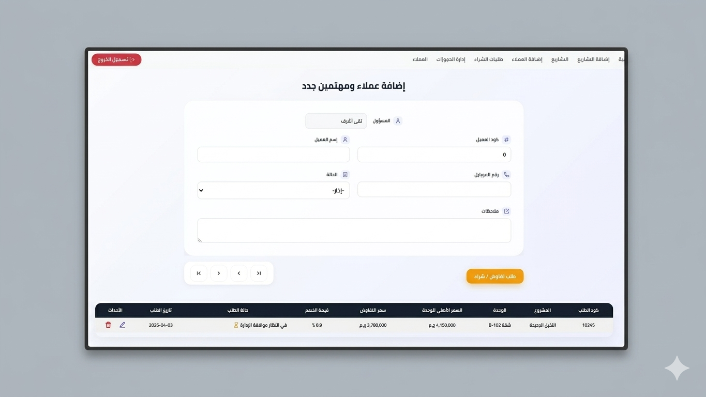 |
| *1. Starting with a new client entry.* | *2. Processing the negotiation logic.* | *3. Success! Data synced to the tracking table.* |

* **Managerial Decision Engine:** Managers receive these requests and can **Approve, Reject** them, ensuring a controlled sales process.
<table style="width: 100%; border-collapse: collapse; border: none; table-layout: fixed;">
  <tr>
    <td style="width: 25%; padding: 5px; text-align: center; border: none; vertical-align: top;">
      
      
<em>1. Negotiation Inbox: Pending purchase offers waiting for managerial review.</em>

    </td>
     <td style="width: 25%; padding: 5px; text-align: center; border: none; vertical-align: top;">
      
      
<em>4. Accepted List: Log of finalized, approved purchases.</em>

    </td>
    <td style="width: 25%; padding: 5px; text-align: center; border: none; vertical-align: top;">
      
      
<em>2. Decision Modal: Action taken to reject an offer with a required reason.</em>

    </td>
    <td style="width: 25%; padding: 5px; text-align: center; border: none; vertical-align: top;">
      
      
<em>3. Excluded List: Log of rejected offers, with an option to restore.</em>

    </td>
   
  </tr>
</table>

### 4. Automated Installment & Payment Engine
* **Dynamic Schedule Generation:** Once a deal is approved, the system automatically calculates and generates a complete **Installment Plan** based on:
    * Total Agreed Price and Down Payment.
    * Repayment period (Number of years).
    * Payment frequency.
* **Payment Status Management:** Real-time tracking of each installment status:
    * **Due (مستحق):** Automatically flagged for upcoming payments.
    * **Paid (مدفوع):** Updated instantly upon payment confirmation.
* **Automated Record Archiving:** Finalized deals are automatically moved to the **Completed Bookings** section for historical tracking and reporting.
* **Professional Reporting:** Generate and print high-quality, branded installment schedules and booking vouchers for clients.
  
<table style="width: 100%; border-collapse: collapse; border: none; table-layout: fixed;">
  <tr>
    <td style="width: 25%; padding: 5px; text-align: center; border: none; vertical-align: top;">
      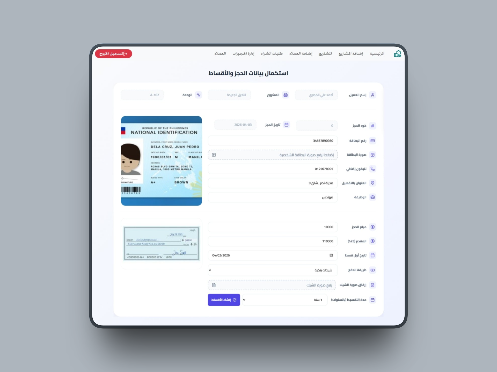
      
<em>1. <strong>Booking Completion:</strong> Collecting client IDs, cheques, and deal details.</em>

    </td>
    <td style="width: 25%; padding: 5px; text-align: center; border: none; vertical-align: top;">
      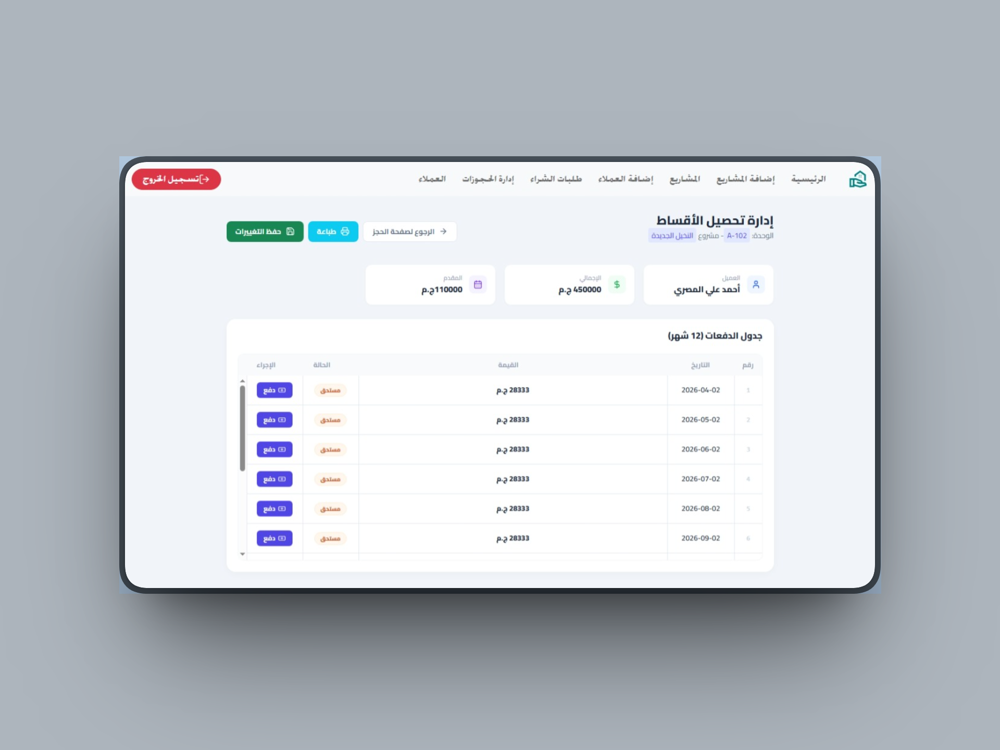
      
<em>2. <strong>Installment Plan:</strong> Real-time dynamic payment schedule management.</em>

    </td>
    <td style="width: 25%; padding: 5px; text-align: center; border: none; vertical-align: top;">
      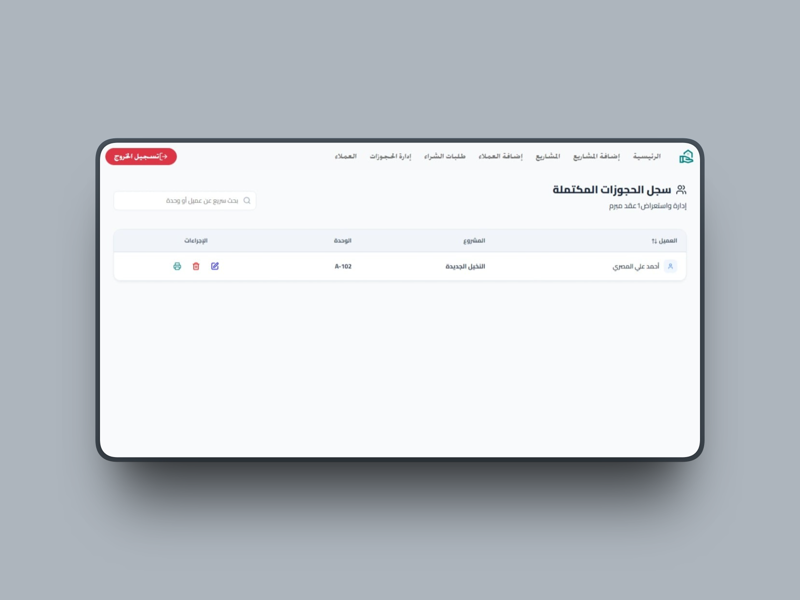
      
<em>3. <strong>Completed Bookings:</strong> Tracking finalized deals in the master records.</em>

    </td>
    <td style="width: 25%; padding: 5px; text-align: center; border: none; vertical-align: top;">
      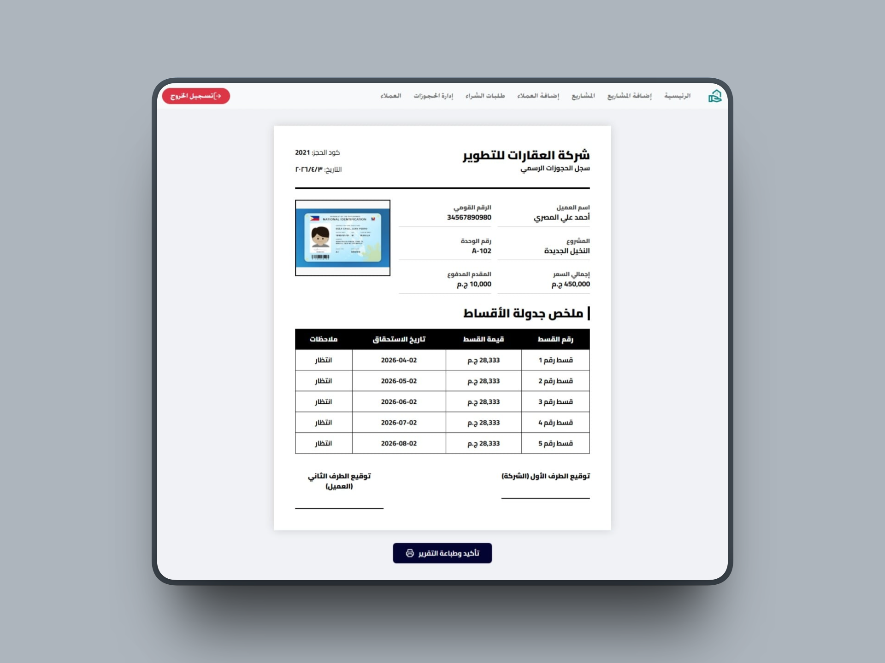
      
<em>4. <strong>Booking Voucher:</strong> Professional printable receipt with transaction data.</em>

    </td>
  </tr>
</table>

### 5. Customer Management (CRM) 
* **Centralized Database:** Managed portal for client profiles and identity records.
* **360° Client View:** Unified history of bookings and installment schedules.

<table style="border-collapse: collapse; border: none; margin: auto;">
  <tr>
    <td style="padding: 10px; text-align: center; border: none; vertical-align: top;">
      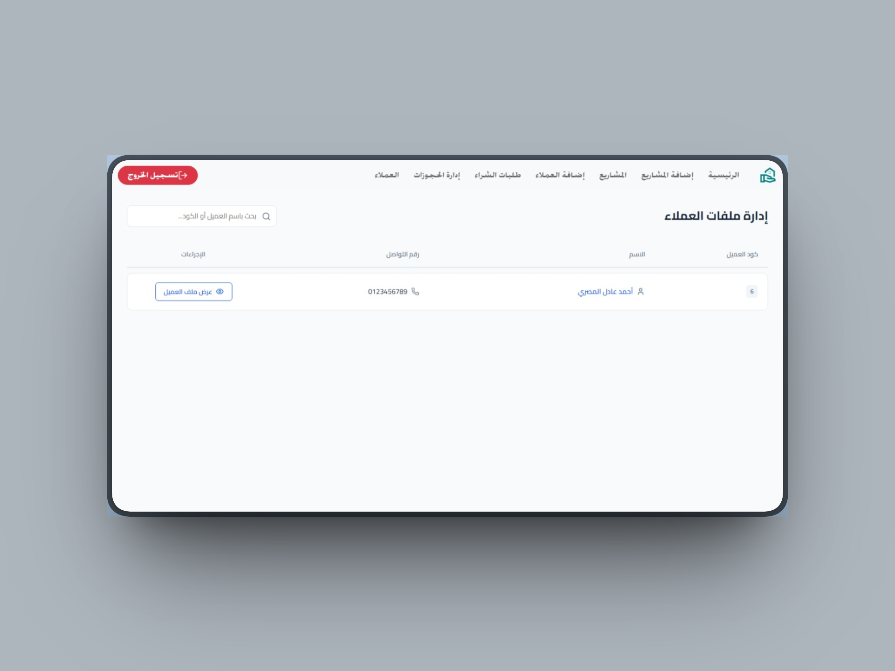
      
<em><b>Client Directory</b></em>

    </td>
    <td style="padding: 10px; text-align: center; border: none; vertical-align: top;">
      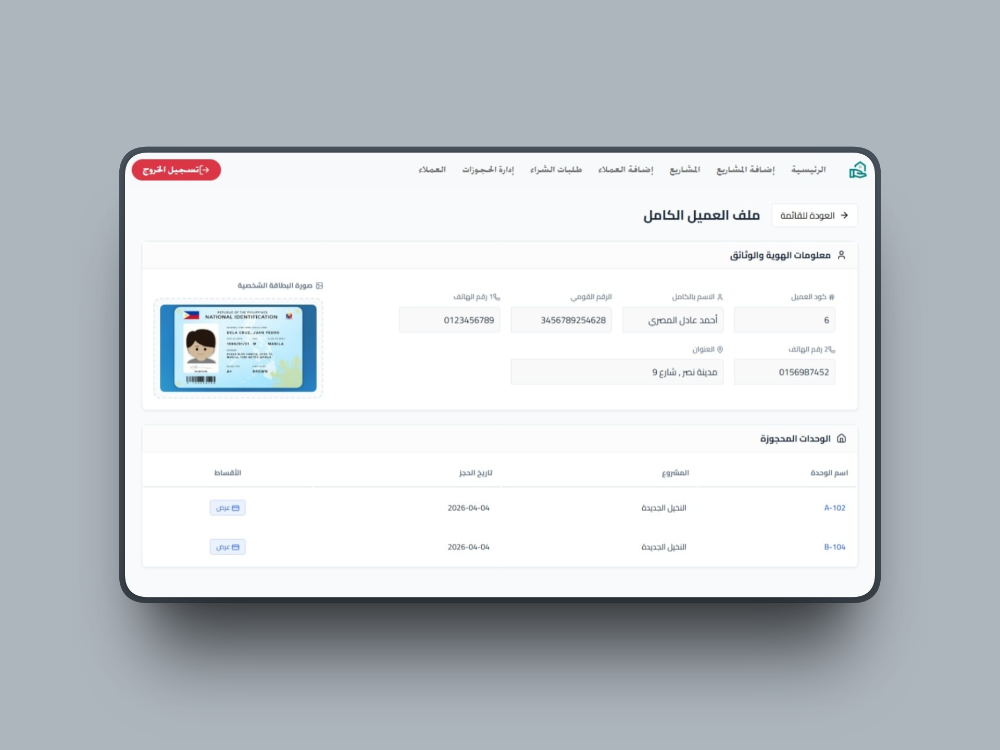
      
<em><b>Comprehensive Profile</b></em>

    </td>
  </tr>
</table>

## Future Logic Enhancements & Roadmap
While the core functionality is fully operational, I have identified several key areas for future logic refinement to further enhance data integrity and user experience:

* **Dynamic Price Validation:** Implementing a safe range for "Suggested Price" inputs to prevent negative discount rates and ensure logical pricing boundaries during negotiations.
* **Negotiation Data Consistency:** Automating the cleanup of related records in `Rejected_Negotiation_Phases` whenever a negotiation is reset, preventing duplicate log entries for the same unit.
* **Down Payment Safety Bounds:** Adding a validation layer to ensure the "Booking Amount" never exceeds the total "Agreed Price," preventing negative balances in installment schedules.
* **Smart Installment Rounding:** Implementing a custom rounding algorithm (e.g., to the nearest 50 or 100 EGP) to ensure clean and professional payment schedules.

##  Tech Stack
* **Frontend:** React.js, Redux Toolkit (Complex State Management),**Bootstrap**,Custom CSS.
* **Backend:** .NET Core Web API (RESTful Services), JWT Authentication, ADO.NET & Entity Framework Core (Hybrid Data Access Layer)
* **Database:** MS SQL Server using EF Core Code-First Approach (Migrations, Data Modeling)
* **Data Visualization:** Chart.js for business analytics.
* **Principles:** Developed with **Clean Code** standards, **SOLID Principles**, and **Focusing on Modular Logic**.

##  Database Architecture & Logic
The system relies on a robust relational schema:
* **One-to-Many:** Projects ➡️ Units.
* **Many-to-One:** Negotiations ➡️ Clients & Units.
* **Automation:** The system pulls validated client data into the booking phase automatically to ensure data integrity and zero manual entry errors. 

###  Database Schema (ERD)
The system relies on a highly normalized relational schema to ensure data integrity.

##  System Workflow (Business Logic)
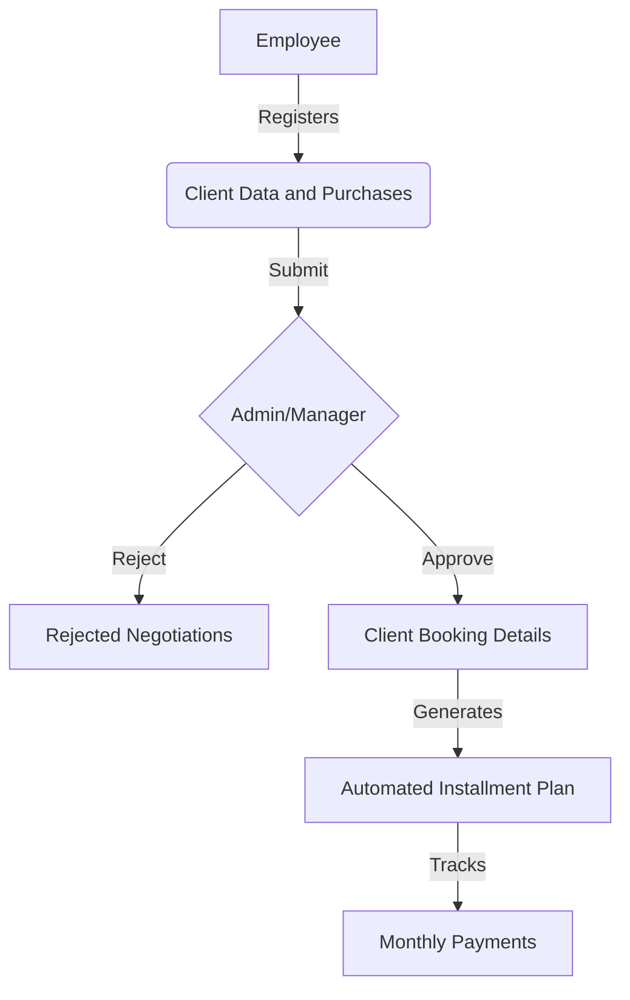
```mermaid
graph TD
A[Employee] -->|Registers| B(Client Data and Purchases)
B -->|Submit| C{Admin/Manager}
C -->|Reject| D[Rejected Negotiations]
C -->|Approve| E[Client Booking Details]
E -->|Generates| F[Automated Installment Plan]
F -->|Tracks| G[Monthly Payments]
```
## 🔧 Installation & Setup
1. Clone the repo: `git clone https://github.com/Toqa-Ashraf8/RealEstate_FullStack_System.git`
2. **Backend:** - Update `appsettings.json` with your SQL connection string.ٍ
   - Run `dotnet ef database update`.
   - Run `dotnet run`.
3. **Frontend:** - Run `npm install`.
   - Run `npm start`.
