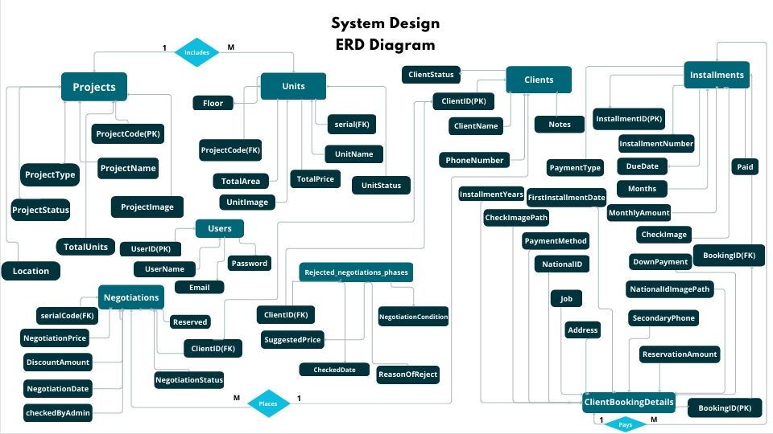
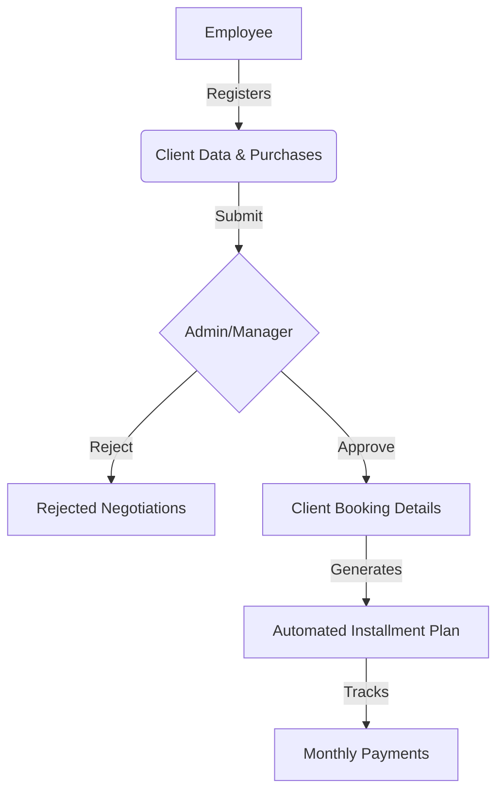

# Real Estate ERP & CRM System 🏗️💼

A specialized Full-Stack ERP (Enterprise Resource Planning) solution designed to digitize real estate operations. This project was inspired by real-world manual workflow challenges to automate project management, client negotiations, and financial installment tracking.
## 🌟 Why This Project? (The Problem)
In many real estate agencies, operations like unit bookings and installment tracking are still handled manually on paper. This leads to data inconsistency and slow approval cycles. I developed this system to provide a **Digital Transformation** solution that centralizes data and automates the financial lifecycle of property sales.

## 🚀 Core Features

### 1. Role-Based Access Control (RBAC) 🔐
* **Secure Auth**: Integrated **JWT Authentication** and **BCrypt** password hashing for robust data protection.
* **Admin Dashboard**: High-level overview with **Charts & Analytics** (Sales performance, unit availability, and project statistics).
* **Managerial Controls**: Exclusive access to approve/reject negotiation requests and manage project configurations.
* **Employee/Sales Portal**: Tools to register clients, browse units, and initiate formal negotiation/purchase requests.
  
### 2. Project & Unit Inventory (Master-Detail) 📋
* **Master-Detail Architecture:** Administrators can create projects and dynamically add associated units with detailed specifications (Area, Floor, Price, Images, and Status).
* **Live Inventory:** A real-time display of available vs. sold units for sales teams.

### 3. Advanced Negotiation & Approval Workflow 🤝
* **Request Initiation:** Sales employees can submit "Negotiation Requests" if a client proposes a different price or payment plan.
* **Managerial Decision Engine:** Managers receive these requests and can **Approve, Reject, or Re-evaluate** them, ensuring a controlled sales process.

### 4. Automated Installment & Payment Engine 📉💰
* **Dynamic Schedule Generation:** Once a deal is approved, the system automatically generates a complete **Installment Plan** based on:
    * Total Agreed Price.
    * Number of years.
    * Payment frequency (Monthly/Quarterly).
* **Payment Tracking:** Employees can log each payment, attach digital receipts/vouchers, and update the installment status in real-time.
* **Printable Schedules:** Generate professional installment tables for clients.

## 🛠️ Tech Stack
* **Frontend:** React.js, Redux Toolkit (Complex State Management),**Bootstrap**,Custom CSS.
* **Backend:** .NET Core Web API (Restful Services),JWT Authentication.
* **Database:** Microsoft SQL Server & Entity Framework Core.
* **Data Visualization:** Chart.js for business analytics.
* **Principles:** Developed with **Clean Code** standards, **SOLID Principles**, and **Testable Architecture**.

## 🏗️ Database Architecture & Logic
The system relies on a robust relational schema:
* **One-to-Many:** Projects ➡️ Units.
* **Many-to-One:** Negotiations ➡️ Clients & Units.
* **Automation:** The system pulls validated client data into the booking phase automatically to ensure data integrity and zero manual entry errors. 

### 🏗️ Database Schema (ERD)
The system relies on a highly normalized relational schema to ensure data integrity.

## 📊 System Workflow (Business Logic)

## 🔧 Installation & Setup
1. Clone the repo: `git clone https://github.com/Toqa-Ashraf8/RealEstate_FullStack_System.git`
2. **Backend:** - Update `appsettings.json` with your SQL connection string.ٍ
   - Run `dotnet ef database update`.
   - Run `dotnet run`.
3. **Frontend:** - Run `npm install`.
   - Run `npm start`.
